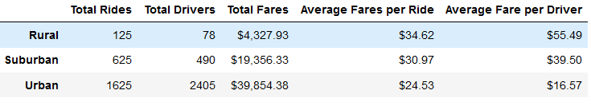
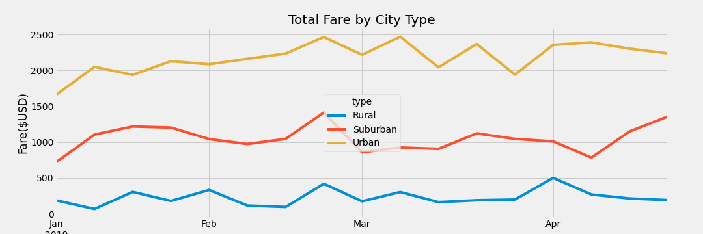

# PyBer_Analysis

## Overview of Project

The main purpose of this analysis is to identify the performance of the company across different city types so that we can take appropriate measures to improve performances in lower performing regions

## Results 

The results of the analysis shows the following findings:

</img>

- The total number of rides is low for rural cities and high for the urban cities. The suburban cities 
- The number of drivers also seems to resonate with the total rides, with urban cities having the highest drivers and rural cities having the lowest number.
- The total fares for the city types tend to be a bit skewed towards urban cities, as urban cities tend to earn the most in terms of Fares. Suburban and rural cities follow along. 
- The average fares per ride shows a somewhat truer picture for the company, as rural cities earn the highest fares per ride and urban cities earn the lowest.
- The average fare per driver is also showing the above picture, with rural drivers earning more per ride, and urban drivers earning the lowest.
- The higher number of drivers as well as rides tends to keep the average fare per ride and driver low in the Urban cities
- There seems to be no particular seasonality for rides taken for any of the city types

Overall, it can be summed up that rural cities are earning much better fare in terms of average fare per ride and average fare per driver.

    All of these can be visualized much better with the following:

</img>

## Summary 

In summary, the following actions can be taken to improve the company's results:

- Increase number of drivers in the suburban & rural areas, as there seems to be a direct relation between number of drivers and rides taken. Also, the number of drivers to rides ratio is less then 100% for both rural and suburban cities.
- The fare for the rural cities can be decreased a bit, so that it attracts more people to take rides, ultimately increasing revenue.
- Same way, the fare for urban cities can be increased a bit as the demand seems high and will ultimately give more to the drivers.